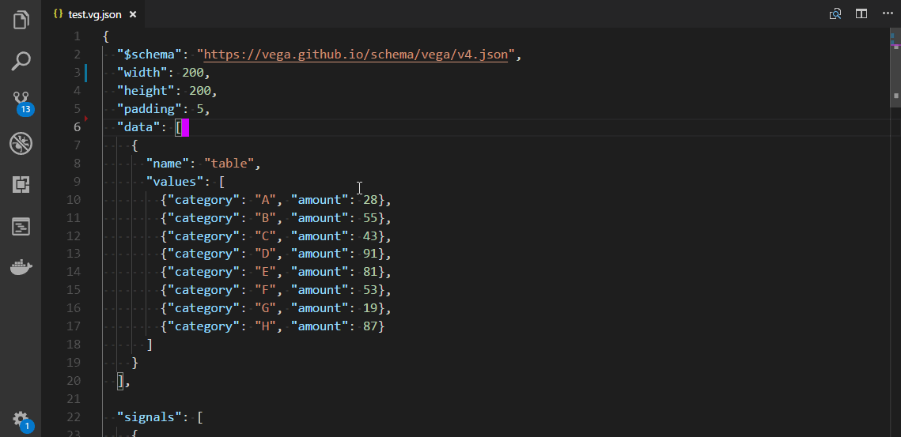
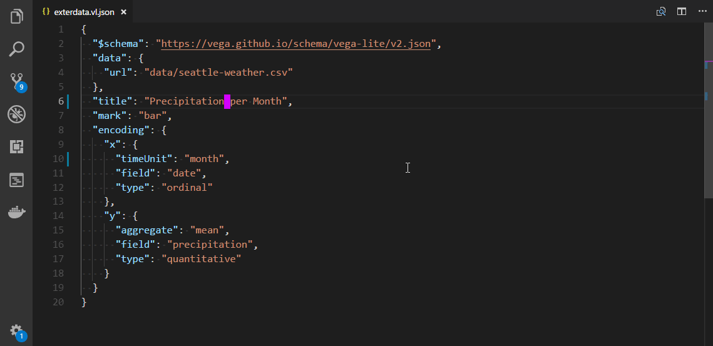
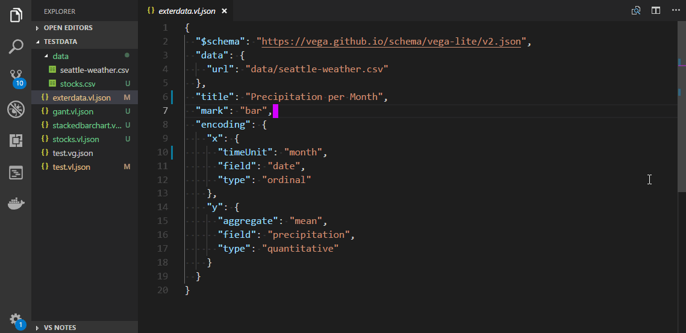

# vega-preview README

vega-preview provides a preview windows for a vega and vega-lite json files.

The source code of this extension is available at: https://github.com/8/vega-preview

The extension is very much inspired by the great [graphviz-preview](https://github.com/EFanZh/Graphviz-Preview) extension!

## Features

### Preview for Vega Files
Live-Preview for Vega json files using the command `vega-preview.showVegaPreview`.

### Preview for Vega-Lite Files
Live-Preview for Vega-Lite json files using the command `vega-preview.showVegaLitePreview`.

### Export to Svg
Export Vega and Vega-Lite json files to svg using the commands `vega-preview.exportVegaToSvg` and `vega-preview.exportVegaLiteToSvg` respectively.

## Requirements
Visual Studio Code 1.24.0+

<!-- ## Extension Settings -->

## Known Issues

- Loading External Data is only supported using relative paths
  (No absolute paths or URIs!)
- The preview is a static Svg, no interactions are currently supported

<!-- Calling out known issues can help limit users opening duplicate issues against your extension. -->

## Release Notes

### 0.9.0
Initial Release
